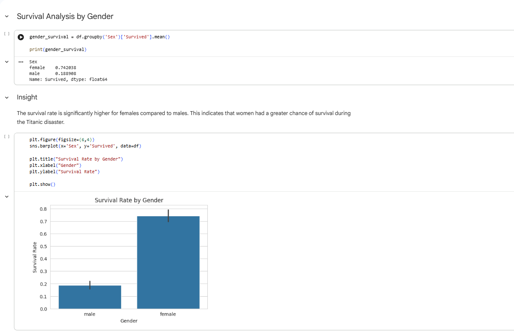
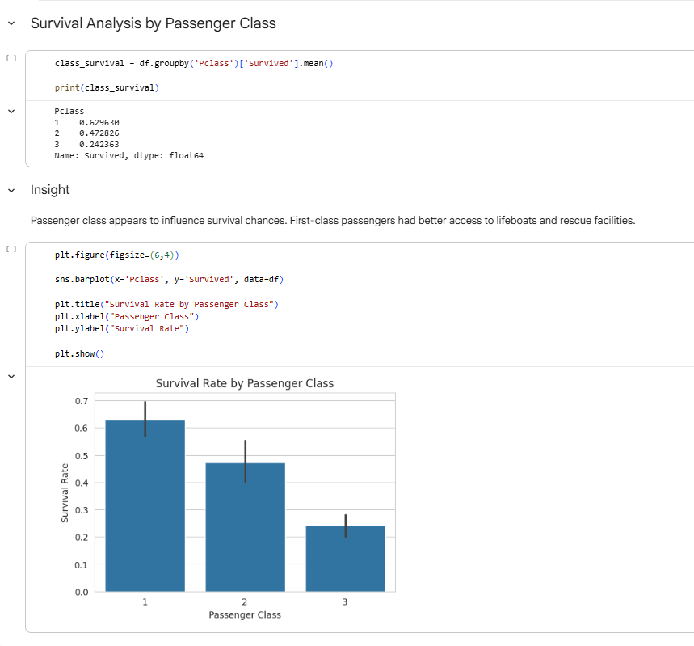
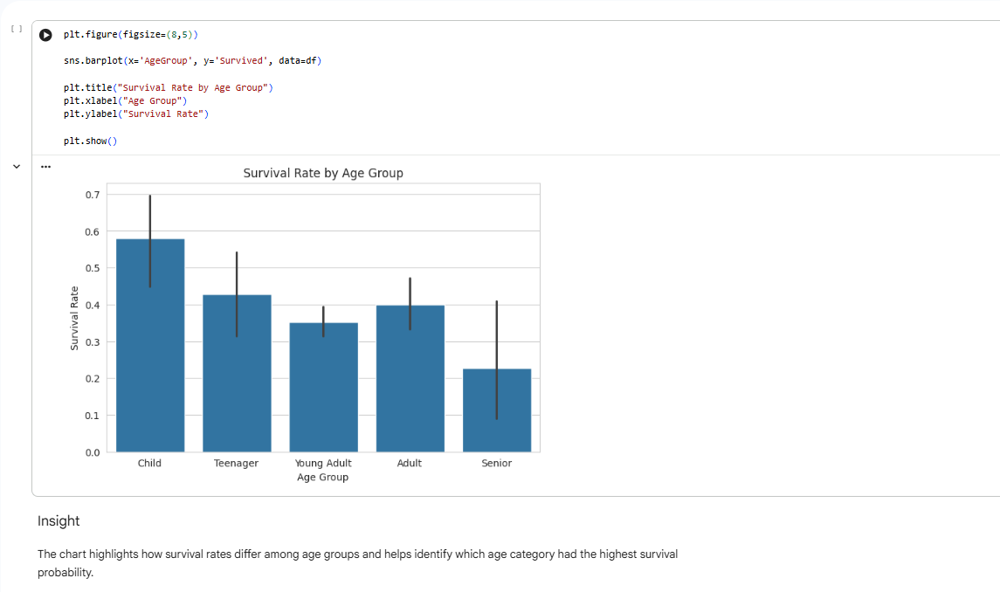
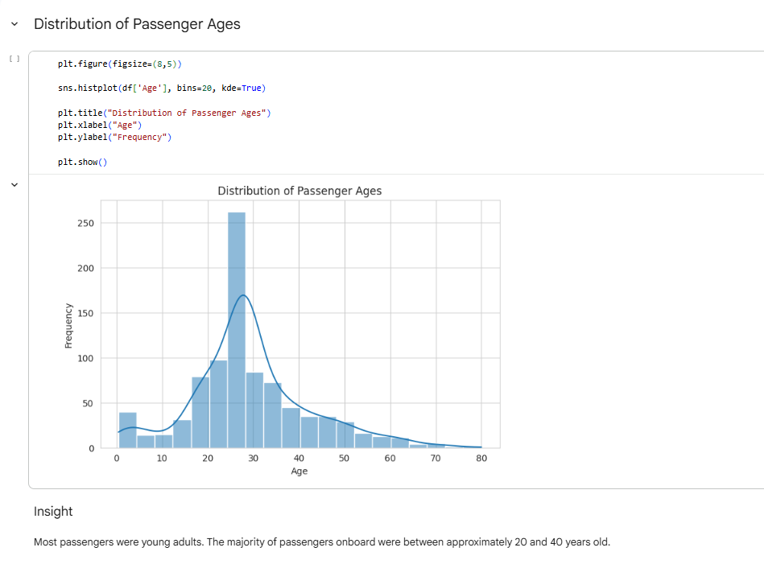
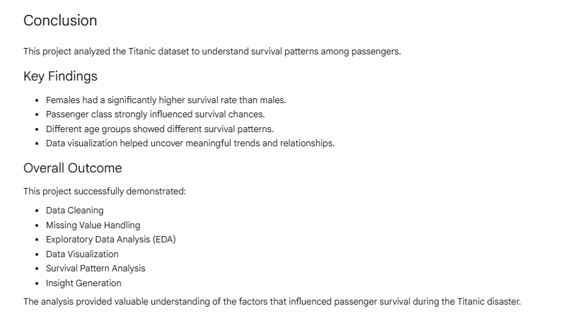

# Titanic Survival Analysis 🚢📊

## Maincrafts Technology Internship – Task 2

### Project Overview

This project analyzes the Titanic dataset to understand passenger survival patterns using Python and data visualization techniques.

### Objectives

* Analyze survival by gender
* Analyze survival by passenger class
* Analyze survival by age group
* Perform data cleaning and preprocessing
* Generate insights using visualizations

### Tools & Technologies

* Python
* Pandas
* NumPy
* Matplotlib
* Seaborn
* Google Colab

### Dataset

Titanic Dataset (Kaggle)

### Key Findings

✅ Females had significantly higher survival rates than males.

✅ First-class passengers had the highest survival probability.

✅ Survival patterns varied across different age groups.

✅ Data visualization helped uncover meaningful patterns and trends.

## Project Files

* Titanic Analysis Report (PDF)
* Titanic Dataset (train.csv)
* Visualization Screenshots

## Project Screenshots

### Survival Rate by Gender

### Survival Rate by Passenger Class

### Survival Rate by Age Group

### Passenger Age Distribution

### Conclusion

## Author

Jay Yende

B.Tech Computer Science Engineering

Symbiosis Institute of Technology, Nagpur

